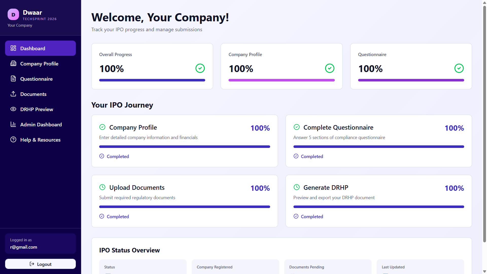
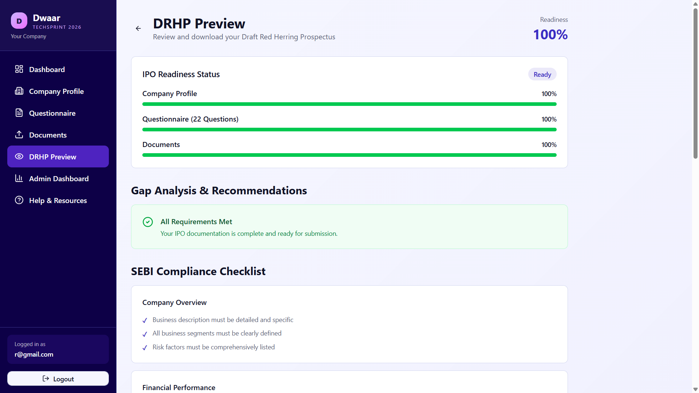

# Dwaar – Unlocking Public Markets for Small Enterprises

> **From IPO intent to a substantially complete DRHP draft—guided, structured, and built for small enterprises.**

[](https://dwaar-sebi-gff-26-demo.vercel.app/)
[](https://hackculture.io/hackathons/sebi-securities-market-techsprint)
[](#license)

Dwaar is a prototype submission for the **SEBI Securities Market TechSprint at Global Fintech Fest 2026**.

## Project Overview

Small and medium enterprises often have the ambition to access public markets but lack the capital, time, and specialist knowledge required to begin the IPO process confidently.

Preparing an SME Draft Red Herring Prospectus (DRHP) can involve:

- **₹25–30 lakh in merchant banker fees** before the issuer is market-ready.
- **Three to four months of drafting and information collection.**
- Complex disclosure requirements under **Schedule VI of the SEBI ICDR Regulations**.
- A high risk of avoidable gaps, inconsistencies, and regulatory observations.
- A potentially damaging **six-month cooling-off period** following rejection or withdrawal in applicable circumstances.

**Dwaar** addresses this early-stage readiness gap. It is a guided digital workspace that helps SME promoters organize company information, understand disclosure requirements, identify missing data, and generate a substantially complete first DRHP draft in days rather than months.

The platform is designed for **SME promoters, founders, and owner-led teams** with limited capital-market experience and constrained access to specialist resources. Dwaar does not replace a merchant banker, legal counsel, auditor, or regulatory review. It helps an issuer arrive at those conversations better prepared.

The name **Dwaar** means **“door”** in Sanskrit and Hindi. It represents the project’s purpose: opening the door to public markets for India’s small enterprises.

## Key Features

### 1. Guided Questionnaire

A structured disclosure workflow covering the nine core areas required for IPO-readiness assessment:

1. Company Background
2. Business Operations
3. Financials
4. Shareholding
5. Promoters and Management
6. Related-Party Transactions (RPTs)
7. Litigation
8. Use of Proceeds
9. Risk Factors

The checked-in demonstration consolidates these topics into representative interactive modules so judges can complete the journey quickly.

### 2. Document Upload Center

A centralized checklist designed around **14 document types commonly required for BSE SME preparation**, including audited financial statements, constitutional documents, board resolutions, director records, governance certificates, and supporting disclosures.

The prototype provides representative upload slots and a one-click mock document pack for demonstration.

### 3. Auto-Generated DRHP Preview

Transforms structured questionnaire responses and company data into a readable DRHP preview aligned with the disclosure organization prescribed by **Schedule VI of the SEBI ICDR Regulations**.

### 4. Gap-Checking Engine

A rule-based review layer that flags:

- Missing mandatory disclosures.
- Incomplete questionnaire sections.
- Numerical inconsistencies.
- Missing supporting documents.
- Potential regulatory red flags requiring professional attention.

### 5. Export Package

The envisioned export package contains:

- A structured DRHP draft.
- A **Merchant Banker Attention Report** highlighting unresolved matters.
- A concise company and issue **Data Summary**.

### 6. Judge-Ready Demo Mode

Company details, questionnaire responses, and mock uploads can be populated in one click. This allows reviewers to experience the full workflow without manually entering test data.

## Screenshots

### Landing Page



### IPO Readiness Dashboard



## Technology Stack

| Area | Technology |
| --- | --- |
| Framework | Next.js 16 with the App Router |
| Frontend | React 19 and TypeScript |
| Styling | Tailwind CSS 4 |
| Components | shadcn/ui conventions with Base UI primitives |
| State Management | React Context API with browser `localStorage` persistence |
| Routing | Next.js App Router |
| Icons | Lucide React |
| Utilities | Class Variance Authority, `clsx`, and `tailwind-merge` |
| Analytics | Vercel Analytics in production |
| Deployment | Vercel |

## Prototype Scope and Limitations

Dwaar is a **functional hackathon prototype** built to demonstrate product feasibility and the complete issuer journey.

- All company, financial, questionnaire, and document data is mocked or simulated.
- There is no production backend, database, object storage, or identity provider.
- Prototype state is stored locally in the browser and may be cleared during logout.
- Mock uploads store document metadata only; no real files are transmitted to a server.
- DRHP generation uses predefined templates with dynamic data insertion.
- Gap checking is rule-based and uses a predefined set of checks.
- The interactive demo consolidates the broader nine-section and 14-document product design into a smaller representative workflow.
- Generated output is not legal advice, regulatory approval, or a filing-ready offer document.
- A registered merchant banker and appropriate legal, accounting, and compliance professionals must review any real IPO filing.

The prototype demonstrates the journey from onboarding and company profiling through questionnaire completion, document collection, readiness review, and export.

## Installation and Setup

### Prerequisites

- [Node.js](https://nodejs.org/) 20 or later
- npm 10 or later
- Git

### 1. Clone the repository

```bash
git clone <your-repository-url>
cd SEBI
```

### 2. Install dependencies

```bash
npm install
```

### 3. Configure environment variables

No environment variables are required for the current prototype.

If future backend services are added, create a `.env.local` file and document the required variables without committing secrets:

```bash
cp .env.example .env.local
```

### 4. Run the development server

```bash
npm run dev
```

Open [http://localhost:3000](http://localhost:3000) in your browser.

## Local Docker Development

Run the frontend, backend, and PostgreSQL together with Docker Compose.

### Prerequisites

- [Docker Desktop](https://www.docker.com/products/docker-desktop/) (or Docker Engine with Compose v2)

### 1. Configure environment variables

```bash
cp .env.example .env
```

Edit `.env` if needed. Do not commit `.env`.

### 2. Start the stack

```bash
docker compose up --build
```

After startup:

| Service | URL |
| --- | --- |
| Frontend | http://localhost:3000 |
| Backend | http://localhost:8000 |
| Swagger | http://localhost:8000/docs |
| ReDoc | http://localhost:8000/redoc |
| PostgreSQL | localhost:5432 |

### Useful Docker commands

```bash
docker compose up --build
docker compose up -d
docker compose logs -f backend
docker compose logs -f frontend
docker compose exec backend bash
docker compose exec db psql -U dwaar -d dwaar
docker compose down
docker compose down -v
```

**Warning:** `docker compose down -v` deletes the named PostgreSQL volume and all local database data. Use it only when you intentionally want a fresh database.

The frontend uses **npm** with `package-lock.json`. The backend uses **uv** with `uv.lock`. Source directories are bind-mounted for hot reload; frontend `node_modules` and backend dependencies remain in container volumes/layers outside the bind mounts.

### 5. Create a production build

```bash
npm run build
npm run start
```

## Project Structure

```text
SEBI/
├── app/                      # Next.js routes and page-level components
│   ├── page.tsx              # Landing page
│   ├── dashboard/            # IPO readiness overview
│   ├── company-profile/      # Company and financial information
│   ├── questionnaire/        # Guided disclosure workflow
│   ├── documents/            # Document upload simulation
│   ├── drhp-preview/         # DRHP preview and gap analysis
│   ├── admin/                # Prototype administrative dashboard
│   ├── help/                 # Help and educational resources
│   └── globals.css           # Global theme and Tailwind styles
├── components/               # Reusable layout and UI components
│   └── ui/                   # Buttons, inputs, and design primitives
├── lib/                      # Contexts, types, mock data, and utilities
│   ├── contexts.tsx          # React Context providers and persistence
│   ├── questionnaire-data.ts # Questions, document requirements, checks
│   ├── demo-data.ts          # Judge-ready fictional data
│   └── types.ts              # Shared TypeScript models
├── public/                   # Static assets, logos, and screenshots
├── package.json              # Dependencies and scripts
└── README.md                 # Project documentation
```

## How to Use the Prototype

1. **Landing Page** — Review the product proposition and select **Start Your IPO Journey**.
2. **Registration** — Create a simulated account and provide initial company details.
3. **Dashboard** — View overall readiness, step-level progress, and pending activities.
4. **Company Profile** — Enter company, management, and financial information, or use **Fill demo data**.
5. **Questionnaire** — Work through the guided disclosure sections. Use **Fill this section** or **Fill all sections** for a faster demonstration.
6. **Document Upload** — Attach supporting records or select **Add demo documents** to simulate the required package.
7. **DRHP Preview** — Review the dynamically assembled draft content.
8. **Gap Checking** — Inspect missing information, recommendations, and readiness indicators.
9. **Export** — Generate and download the prototype DRHP output package.

Try the hosted version: **[dwaar-sebi-gff-26-demo.vercel.app](https://dwaar-sebi-gff-26-demo.vercel.app/)**

## Acknowledgments

Dwaar was created for the **SEBI Securities Market TechSprint at Global Fintech Fest 2026**.

Special thanks to:

- **Securities and Exchange Board of India (SEBI)** for framing the challenge and advancing securities-market innovation.
- **Global Fintech Fest (GFF)** for providing a platform for financial-technology collaboration.
- **HackCulture** for organizing and supporting the TechSprint.
- The mentors, reviewers, open-source maintainers, and developer-tooling communities whose resources helped shape this prototype.

## License

This project is available under the **MIT License**. You may use, modify, and distribute the software in accordance with the license terms.

This license applies to the source code only. SEBI, Global Fintech Fest, HackCulture, and other third-party names and logos remain the property of their respective owners.

## Contact / Author

**Prathamesh Bhamare**  
Student at CWIT Pune | SWE Intern @ Arealis

- Email: [prathamesh7x1@gmail.com](mailto:ftw.prathambhamare7@gmail.com)
- GitHub: [RealPratham21](https://github.com/RealPratham21)
- Live Demo: [Dwaar on Vercel](https://dwaar-sebi-gff-26-demo.vercel.app/)

---

<p align="center">
  <strong>Dwaar</strong> — opening the door to public markets for small enterprises.
</p>
