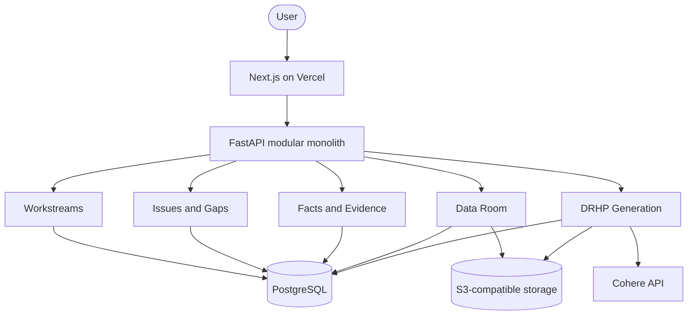

# Dwaar

**From company information and evidence to a review-ready draft offer document for SME IPO preparation.**

Dwaar is a structured IPO preparation workspace for Indian SME promoters. It helps teams move from scattered company information, documents and disclosures toward a traceable, review-ready draft Red Herring Prospectus (DRHP) — before professional due diligence, certification and filing.

Built for **[SEBI Securities Market TechSprint @ GFF 2026](https://hackculture.io/hackathons/sebi-securities-market-techsprint)** — Problem Statement 04: *Simplifying IPO Offer Document Preparation for SMEs*.

[](https://dwaar-sebi-gff-26-demo.vercel.app/)
[](https://nextjs.org/)
[](https://fastapi.tiangolo.com/)
[](https://www.postgresql.org/)

---

## Demo

For the pre-filled **Nivara Techfab Private Limited** demonstration workspace:

| | |
| --- | --- |
| **Email** | `nivara.demo@example.com` |
| **Password** | `Password1` |

This account is intentionally populated for hackathon evaluation. You can also register and complete fresh SME onboarding to experience the full issuer journey from scratch.

**Live app:** [dwaar-sebi-gff-26-demo.vercel.app](https://dwaar-sebi-gff-26-demo.vercel.app/)

---

## Why Dwaar?

SME IPO offer-document preparation is difficult because preparation spans months, depends heavily on intermediaries from an early stage, and requires promoters to organise extensive business, financial, legal, governance and offer-related disclosures — often without prior capital-markets experience.

Information typically lives across people, spreadsheets, email threads and document folders long before a coherent draft exists.

**Dwaar addresses the preparation gap**, not regulated filing or professional certification.

| Challenge | What promoters face |
| --- | --- |
| **Time** | Repeated gathering, reconciliation and drafting over many months |
| **Cost** | Specialist involvement begins before information is organised |
| **Complexity** | Many disclosure domains must eventually become one coherent document |
| **Fragmentation** | Data sits across teams, files and systems without a single source of truth |

---

## Solution

Dwaar gives promoters a guided path:

```text
SME promoter
  → 12 guided workstreams
  → structured issuer data + documents
  → canonical facts & evidence
  → issues & reconciliation
  → immutable generation snapshot
  → chapter-based DRHP draft
  → professional review (outside Dwaar)
```

Dwaar **does not** replace SEBI-registered merchant bankers, counsel, auditors or other authorised professionals. It helps promoters arrive at professional review better prepared.

---

## Platform overview

### 12 preparation workstreams

1. Company & Incorporation
2. IPO Setup & Eligibility
3. Capital & Ownership
4. Business & Operations
5. Objects of the Issue
6. Financials & KPIs
7. Management & Governance
8. Industry & Market
9. Group Entities & Related Parties
10. Borrowings, Assets & Contracts
11. Litigation, Approvals & Compliance
12. Intermediaries & Filing

Each workstream captures structured issuer information with backend-authored progress tracking.

### Document intelligence (Company & Incorporation)

The richest document pipeline is implemented for **Company & Incorporation**:

`Upload → OCR/extraction → assertions/facts → evidence linkage → discrepancy review`

Other workstreams primarily use structured issuer input and deterministic validation in the current prototype.

### Issues & Gaps (G4)

Global aggregation of missing information, inconsistencies, evidence gaps, DRHP readiness items, generation warnings and professional-review requirements — with severity, workstream context and deep links back to source.

### Facts & Evidence (G5)

Canonical facts with support types:

- document-backed
- structured issuer input
- calculated
- professional confirmation

Facts used in the latest DRHP draft are tracked separately from total canonical facts.

### Data Room (G6)

Central inventory of uploaded documents and expected due-diligence requirements across workstreams — distinguishing provided, missing and review-applicability states.

### DRHP generation (G3)

- **18 chapters** mapped to canonical workstream ownership
- **Immutable generation snapshots** capturing source state at generation time
- **Chapter source bundles** with `SourceRef` / `EvidenceRef` provenance
- **Structured Document AST** persisted per chapter version
- **Cohere** used for bounded narrative generation where appropriate; deterministic blocks where facts are authoritative
- **PDF and DOCX export** from persisted AST — exports do not regenerate content
- **Staleness detection** when source information changes after a draft was generated

<details>
<summary><strong>18 DRHP chapters (canonical registry)</strong></summary>

1. Cover Page & Front Matter
2. Definitions & Abbreviations
3. Summary of DRHP
4. Risk Factors
5. General Information & The Issue
6. Capital Structure & Ownership
7. Objects of the Issue
8. Basis for Issue Price
9. Industry Overview
10. Business & Operations
11. Company History, Promoters & Corporate Structure
12. Management & Governance
13. Financial Information & MD&A
14. Legal, Regulatory & Approvals
15. Group Companies & Related Party Transactions
16. Terms, Structure & Procedure of the Issue
17. Material Contracts & Documents for Inspection
18. Declarations, AOA & Miscellaneous

</details>

### Reports & Exports (G7)

- Readiness report (PDF)
- Issues register (XLSX / CSV)
- Facts & Evidence register (XLSX)
- Data Room register (XLSX)
- Preparation workbook (XLSX)
- Latest DRHP draft (PDF / DOCX via G3 export routes)

### Dashboard

IPO preparation command centre aggregating workstream progress, open issues, facts/evidence counts, data room coverage, latest DRHP state and deterministic next-best actions.

---

## Architecture

Dwaar is a **modular monolith**: one FastAPI backend with domain modules, one Next.js frontend, PostgreSQL for authoritative state, and S3-compatible object storage for documents.



| Layer | Technology |
| --- | --- |
| Frontend | Next.js 16, React 19, TypeScript, Tailwind CSS 4 |
| Backend | FastAPI, SQLAlchemy 2, Alembic, Pydantic v2 |
| Database | PostgreSQL 16 |
| Object storage | S3-compatible (MinIO locally, Railway Bucket in production) |
| AI | Cohere for bounded DRHP narrative generation only |
| Frontend hosting | Vercel |
| Backend hosting | Railway (API + document worker) |

### DRHP generation architecture

1. **Canonical chapter mapping** — each of 18 chapters maps to owning workstreams and source bundles.
2. **Generation snapshot** — immutable capture of facts, issues and structured inputs at generation time.
3. **ChapterSourceBundle** — per-chapter inputs with `SourceRef` and `EvidenceRef` links.
4. **Document AST** — structured chapter content persisted as versions (not ephemeral LLM output).
5. **Hybrid generation** — deterministic tables/calculations where authoritative; Cohere for narrative sections within bounded prompts.
6. **Export** — PDF/DOCX rendered from persisted AST without re-invoking generation.

Cohere does **not** control deterministic calculations or factual authority.

### Evidence model (honest scope)

| Workstream area | Current depth |
| --- | --- |
| Company & Incorporation | Full document → extraction → fact → evidence → review pipeline |
| Other workstreams | Structured issuer input + deterministic validation |
| Global Facts & Evidence | Unified view with support-type distinction |

---

## Prototype boundaries

- This is a **hackathon prototype**, not a regulatory filing system.
- Dwaar is **not** SEBI-approved, does not certify compliance, and does not provide legal advice.
- Dwaar **does not** replace merchant bankers, counsel, auditors or other authorised professionals.
- Document extraction is **not** implemented uniformly across every workstream.
- Generated drafts require **professional review** before any filing use.
- Professional due diligence, certification and regulatory filing remain outside the platform.

---

## Project structure

```text
DWAAR-SEBI-GFF-26-Demo/
├── frontend/                 # Next.js app (App Router)
│   ├── app/                  # Routes: landing, auth, onboarding, /projects/demo/*
│   ├── components/           # Workspaces, landing, auth, UI
│   └── lib/                  # API clients, DRHP registry, auth, workstreams
├── backend/
│   ├── app/
│   │   ├── modules/          # Domain modules (workstreams, drhp, issues_gaps, …)
│   │   ├── models/           # SQLAlchemy models
│   │   └── api/v1/           # API router aggregation
│   ├── alembic/              # Database migrations
│   └── tests/
├── fixtures/nivara-techfab/  # Nivara ground-truth fixtures & document generators
├── docs/                     # Deployment & smoke-test guides
├── deploy/                   # Railway env examples
├── infra/minio/              # Local object-storage init
├── compose.yaml              # Local Docker stack
└── .env.example              # Root environment template
```

---

## Local development

### Prerequisites

- [Docker Desktop](https://www.docker.com/products/docker-desktop/) (recommended), or Node.js 20+ and Python 3.12+ with PostgreSQL
- Git

### 1. Configure environment

```bash
cp .env.example .env
```

Edit `.env` as needed. **Do not commit secrets.**

Key variables (see `.env.example` for the full list):

| Variable | Purpose |
| --- | --- |
| `DATABASE_URL` | PostgreSQL connection (`@db:5432` inside Docker; `localhost:5432` on host) |
| `JWT_SECRET` | Access/refresh token signing |
| `NEXT_PUBLIC_API_BASE_URL` | Frontend → API base (e.g. `http://localhost:8000/api/v1`) |
| `COHERE_API_KEY` | Single Cohere key (fallback) |
| `COHERE_API_KEYS` | Comma-separated key pool (preferred when set) |
| `S3_ENDPOINT` / `S3_BUCKET` | Object storage (MinIO locally) |
| `ENABLE_DEV_SEED` / `DEV_SEED_SECRET` | Gated Nivara seed endpoint (local/dev only) |

**Cohere configuration:** the backend accepts `COHERE_API_KEYS` (comma-separated pool) and falls back to `COHERE_API_KEY`. Set `DRHP_USE_FAKE_COHERE=true` for CI/tests without live API calls.

### 2. Start with Docker Compose (recommended)

```bash
docker compose up --build
```

| Service | URL |
| --- | --- |
| Frontend | http://localhost:3000 |
| Backend API | http://localhost:8000 |
| Swagger | http://localhost:8000/docs |
| PostgreSQL | localhost:5432 |

Useful commands:

```bash
docker compose logs -f migrate
docker compose exec backend uv run alembic current
docker compose down -v   # wipes local DB volume — use intentionally
```

### 3. Frontend only (API already running)

```bash
cd frontend
npm install
npm run dev
```

Production build requires `NEXT_PUBLIC_API_BASE_URL` (see `frontend/.env.production.example`).

### 4. Backend only (without Docker)

```bash
cd backend
uv sync
uv run alembic upgrade head
uv run uvicorn app.main:app --reload --host 0.0.0.0 --port 8000
```

---

## Deployment

| Component | Host |
| --- | --- |
| Frontend | Vercel |
| API | Railway |
| Document worker | Railway (same image, worker command) |
| PostgreSQL | Railway |
| Object storage | Railway Bucket (S3-compatible) |

See [docs/deployment.md](docs/deployment.md) and [docs/cloud-smoke-checklist.md](docs/cloud-smoke-checklist.md) for release order, migration ownership and smoke tests.

---

## Testing

### Backend

```bash
cd backend
uv run pytest
```

Postgres integration tests require `DATABASE_URL` or `TEST_DATABASE_URL`.

### Frontend

```bash
cd frontend
npm run typecheck
npm run test
npm run lint
npm run build   # requires NEXT_PUBLIC_API_BASE_URL
```

---

## Team

**Team Stay24**

**Prathamesh Bhamare** — Creator / sole team member

The project was registered while Prathamesh was completing his Diploma in Computer Engineering at CWIT Pune.

---

## Hackathon

**SEBI Securities Market TechSprint @ Global Fintech Fest 2026**

**Problem Statement 04:** Simplifying IPO Offer Document Preparation for SMEs

**Team:** Stay24

Event: [hackculture.io/hackathons/sebi-securities-market-techsprint](https://hackculture.io/hackathons/sebi-securities-market-techsprint)

---

## License

MIT License — see repository license file. Third-party names and logos remain property of their respective owners.
